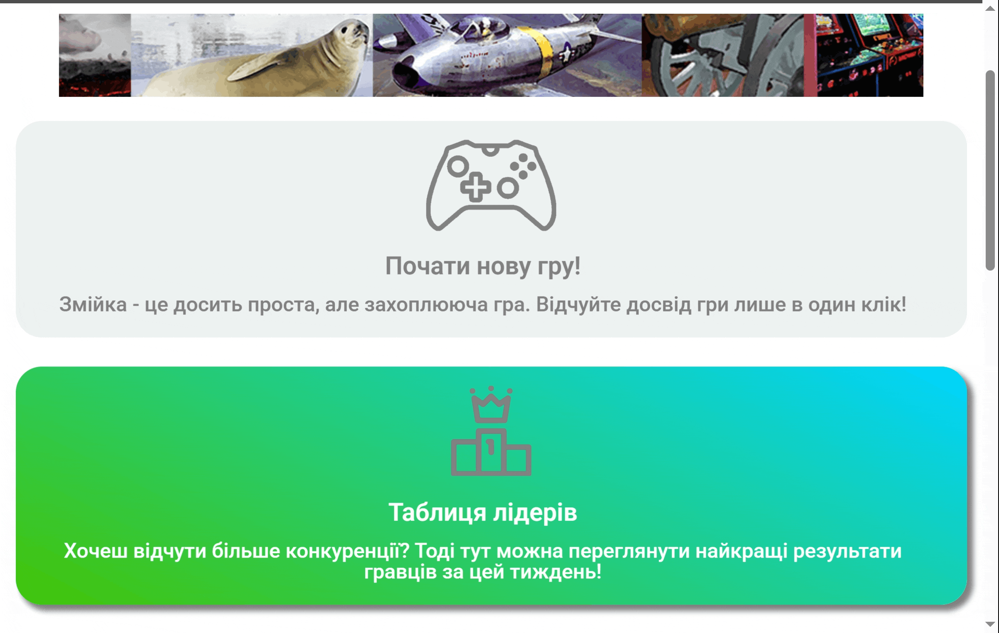
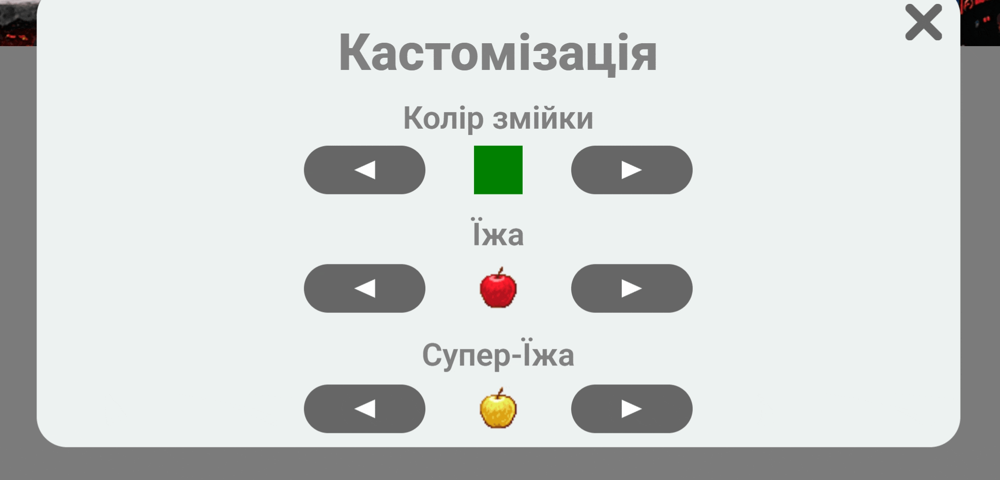
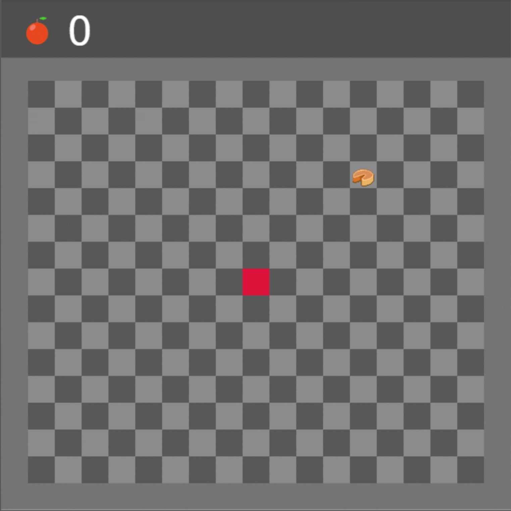

# Snake game web-page 
<!-- TABLE OF CONTENTS -->
<details>
  <summary>Table of Contents</summary>
  <ol>
    <li>
      <a href="#about-the-project">About The Project</a>
      <ul>
        <li><a href="#built-with">Built With</a></li>
      </ul>
    </li>
    <li>
      <a href="#getting-started">Getting Started</a>
      <ul>
        <li><a href="#prerequisites">Prerequisites</a></li>
        <li><a href="#installation">Installation</a></li>
      </ul>
    </li>
<li>
  <a href="#usage">Usage</a>
  <ul>
    <li><a href="#server-deployment">Server deployment</a></li> 
    <li><a href="#launching-the-application-with-local-hosting">Launching the application with local hosting</a></li>
    <li><a href="#launching-the-application-with-dynamic-hosting-provider">Launching the application with dynamic hosting provider</a></li>
  </ul>
</li>
    <li>
      <a href="#services">Services</a>
      <ul>
        <li><a href="#starting-game">Starting game</a></li>
        <li><a href="#player-customization">Player customization </a></li>
        <li><a href="#board-customization">Board customization </a></li>
      </ul>
    </li>
  </ol>
</details>

## About The Project
A basic snake game web-application. Except basic game, it has leaderboard, customization and match history. This project was developed as a coursework to demonstrate web application with Node.js and Express.

### Built With
Languages:
* [](#)
* [](#)
* 	[](#)

Frameworks:
* 
* 

Databases:
* 

## Getting Started
### Prerequisites
* Software requires Node.js. It can be downloaded [here](https://nodejs.org/en/download).

### Installation
1. Clone the repository
  ```sh
  git clone https://github.com/DaniilKhortov/CW-2024.git
  ```
2. Change the git remote (optional if you want to change your origin)
  ```sh
  git remote set-url origin https://github.com/DaniilKhortov/CW-2024.git
  ```
3. Install node.js packages
  ```sh
  npm install
  ```


## Usage
### Server deployment
The application requires a dynamic server environment. It can be set up:
1. With dynamic hosting provider. For example, [Render](https://render.com/).
2. With local hosting.
   
### Launching the application with local hosting
1. To run the application, navigate to the CW-2024/js directory.
   
2. There is a file "server.js". It is run by command:
  ```sh
  node server.js
  ```

3. In browser, website can be found under address http://localhost:3000/index.html.

### Launching the application with dynamic hosting provider
1. Choose server rent plan.
2. Upload project directory.
3. Input starting command:
```sh
node server.js
```

## Services
### Starting game



### Player customization 


### Board customization 
By allowing geolocation, board will be automaticaly changed by weather in your region 



